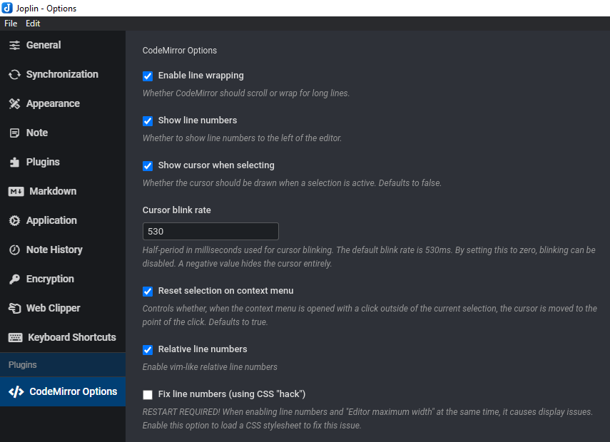
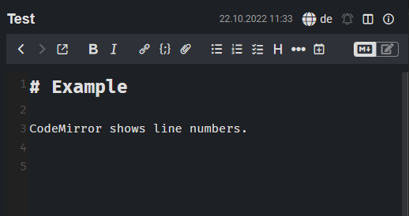
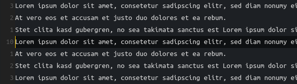

> [!IMPORTANT]
> This plugin was written for CodeMirror 5 and isn't compatible with CodeMirror 6 (which is the default since Joplin 3.1.x).  
> For the new CodeMirror version, I recommend this plugin: [Extended Markdown editor settings](https://github.com/personalizedrefrigerator/joplin-plugin-extra-editor-settings)

<table>
    <tr>
        <td colspan="3" align="center">
            <h3>CodeMirror Options</h3>
        </td>
    </tr>
    <tr>
        <td width="225px" rowspan="7" align="center">
             
            

                <strong>Joplin Plugin</strong> 
                CodeMirror&nbsp;Options
            

        </td>
    </tr>
    <tr>
        <td colspan="2"><strong>Adds some CodeMirror options to Joplin's settings, such as line numbers and line wrapping.</strong></td>
    </tr>
    <tr>
        <td colspan="2">
            
            
        </td>
    </tr>
    <tr>
        <td>Links:</td>
        <td>
            
        </td>
    </tr>
    <tr>
        <td>Built with:</td>
        <td>
            <a href="https://github.com/laurent22/joplin/tree/dev/packages/generator-joplin">generator-joplin</a>
        </td>
    </tr>
    <tr>
        <td>Inspired by:</td>
        <td>
            <a href="https://github.com/shantanugoel/joplin-plugin-cm-linenumbers">Joplin Line Numbers Plugin</a>
        </td>
    </tr>
    <tr>
        <td>Other plugins by me:</td>
        <td>
            <a href="https://github.com/FelisDiligens/joplin-plugin-search-and-replace">Search & Replace</a>,
            <a href="https://github.com/FelisDiligens/joplin-plugin-multimd-table-tools">MultiMarkdown Table Tools</a>
        </td>
    </tr>
</table>

This is a simple plugin for [Joplin](https://joplinapp.org/) that exposes some CodeMirror options to the user, such as line wrapping or line numbers.

> **Note**:
> This plugin only affects the Markdown editor (CodeMirror), not the WYSIWYG editor (TinyMCE).

See the screenshots below:

## 📸 Screenshots

#### Options

#### Line numbers

#### Vim-like relative line numbers

## ⚙️ Installation

### From the repo (recommended)

- Go to the settings (Tools → Options) → Plugins
- Search for `CodeMirror Options`
- Click 'Install' and restart Joplin
- Enjoy

### Manually

- Download the *.jpl file from the [releases](https://github.com/FelisDiligens/joplin-plugin-cmoptions/releases) section
- Go to the settings (Tools → Options) → Plugins
- Click the gear next to 'Manage your plugins' and choose 'Install from file'
- Select the downloaded *.jpl file
- Restart Joplin
- Enjoy

## ⚡ Usage

- After installation, a new section will appear in the options. (see [screenshot](#-screenshots))
- Tweak to your heart's content.

## Development

Text from "generator-joplin"

This is a template to create a new Joplin plugin.

The main two files you will want to look at are:

- `/src/index.ts`, which contains the entry point for the plugin source code.
- `/src/manifest.json`, which is the plugin manifest. It contains information such as the plugin a name, version, etc.

## Building the plugin

The plugin is built using Webpack, which creates the compiled code in `/dist`. A JPL archive will also be created at the root, which can use to distribute the plugin.

To build the plugin, simply run `npm run dist`.

The project is setup to use TypeScript, although you can change the configuration to use plain JavaScript.

## Updating the plugin framework

To update the plugin framework, run `npm run update`.

In general this command tries to do the right thing - in particular it's going to merge the changes in package.json and .gitignore instead of overwriting. It will also leave "/src" as well as README.md untouched.

The file that may cause problem is "webpack.config.js" because it's going to be overwritten. For that reason, if you want to change it, consider creating a separate JavaScript file and include it in webpack.config.js. That way, when you update, you only have to restore the line that include your file.

