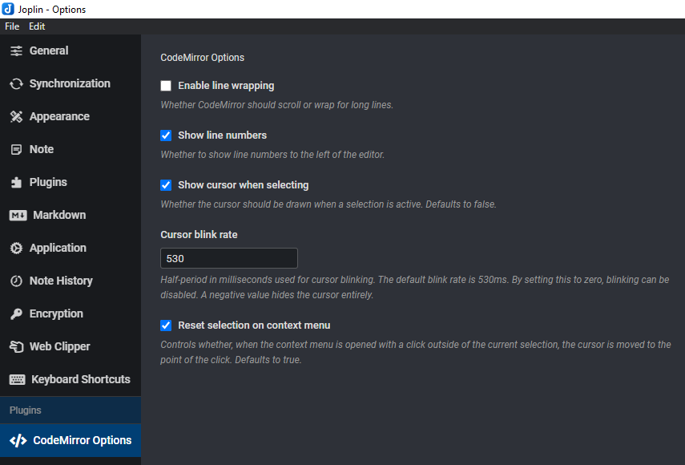
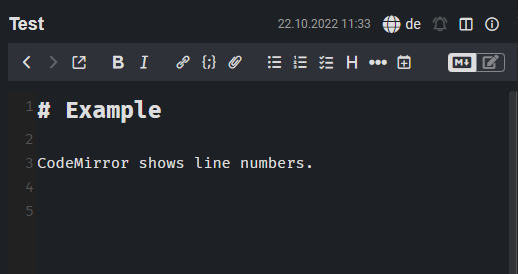

# Joplin CodeMirror options plugin

This is a simple plugin for [Joplin](https://joplinapp.org/) that exposes some CodeMirror options to the user, such as line wrapping or line numbers.

See the screenshots below:

## Installation

### From the repo (recommended)

- Go to the settings (Tools → Options) → Plugins
- Search for CodeMirror Options
- Click 'Install' and restart Joplin
- Enjoy

### Manually

- Download the *.jpl file from the [releases](https://github.com/FelisDiligens/joplin-plugin-cmoptions/releases) section
- Go to the settings (Tools → Options) → Plugins
- Click the gear next to 'Manage your plugins' and choose 'Install from file'
- Select the downloaded *.jpl file
- Enjoy

## Usage

- After installation, a new section will appear in the options. (see screenshot)
- Tweak to your heart's content.

---

## Development

The main two files you will want to look at are:

- `/src/index.ts`, which contains the entry point for the plugin source code.
- `/src/manifest.json`, which is the plugin manifest. It contains information such as the plugin a name, version, etc.

### Building the plugin

To build the plugin, simply run `npm run dist`.

### Updating the plugin framework

To update the plugin framework, run `npm run update`.
